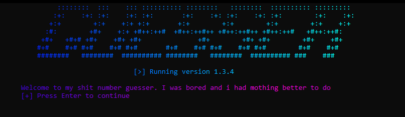

 

<h1 align="center">Number Guesser</h1>
## :dart: About ##
I haven't realy coded in python for the past few years so i have been using these random projects as a good way to relearn python. Essentially just a dumb number guesser but used this to relearn guis, gradients, get more comfortable with def. I am not the most proud of this however it has been one of my first projects in at least 3 years so ig its good enough. Also means i get more comfortable with github

Ty freezer for ur help, ur the best :heart:

## :sparkles: Features ##

:heavy_check_mark: Number guesser bit\
:heavy_check_mark: Debugging/Logging (Soon)\
:heavy_check_mark: Updates and credits\
:heavy_check_mark: Easter Eggs (Soon:tm:)\

ty for reading my incoherant nonsense

